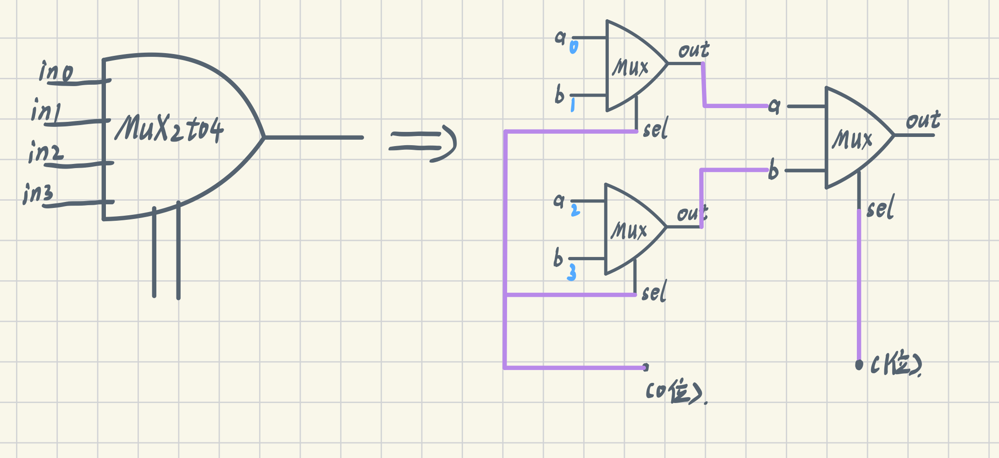
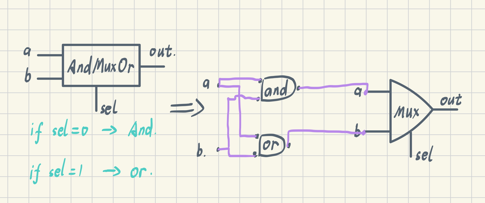
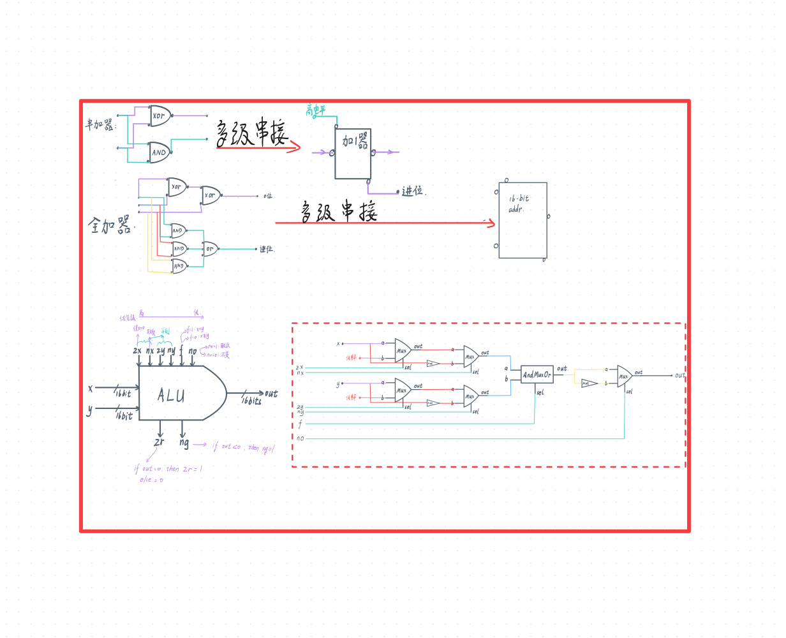

# From Nand to Tetris

> 课程：[中配] 从与非门到俄罗斯方块（计算机系统要素）。边看边用 Python 模拟实现，代码见本地 `my_python_computer/my_cpu` 项目。

# Project 1：基本逻辑元件

## 1. 基础元件：NAND

其物理实现各不相同（<mark class="va-hl">埋坑</mark>），是现代计算机的基石。

## 2. 其它基础逻辑门

从 NAND 出发，可以推导到 NOT 门、AND 门、OR 门、XOR 门等其它基础逻辑元件。

## 3. 多位基础逻辑门

基础逻辑元件还可以推广到多位。很简单，如：八位与门是八根导线每一根分别取与运算。

## 4. 多路选择器

为了电路的实际需要，我们通常需要"多路选择器"。试想有两个通路 A 和 B，你需要一个拉杆来控制 A 端的信息输出而非 B 端，这根"拉杆"的信号就起到了选择的作用。

一般地，选择接口如果有 N 根导线，那么可供选择的通路就有 2 的 N 次方个，这样的多路选择器可以很简洁地构建出来：

**图 1. 从二路选择器到四路选择器**

也可将逻辑门纳入选择：

**图 2. 逻辑运算间的选择**

> 本单元重在理解和灵活运用，初步感受基础逻辑门可以操作一些事情就可以了。

# Project 2：运算

## 知识点

半加器；全加器；加一器；多位行波加法器（并非最优，<mark class="va-hl">埋坑</mark>）；ALU 算术元件；补码和二进制减法

**过于简化的 ALU 及其它一些知识**

## 下一步

- [ ] Project 3：时序逻辑（触发器、寄存器、计数器）
- [ ] 用 Python 实现并测试全部基础门（见 [my_cpu 测试](/posts/00-prerequisites/) 配套练习）

> 相关：[00 前置基础](/posts/00-prerequisites/) ｜ [学习任务清单](/posts/study-plan/)